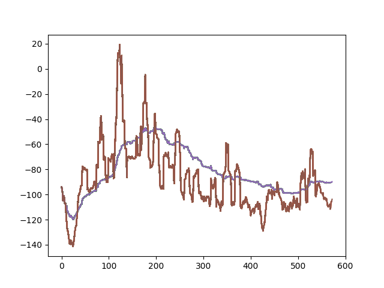

# HouseCleanBot

Deep Q-learning agent that learns a coverage policy for a grid-based house environment. The project combines a custom environment, a convolutional Q-network, prioritized experience replay, training/evaluation loops, and a GPU-ready Docker environment.

## Results

The training output tracks total reward and the percentage of reachable cells visited using short- and long-window moving averages.



A recorded inference run is available in [`demo.mp4`](demo.mp4).

## Project Structure

- `map.py`: grid environment, movement, obstacles, and coverage state.
- `DQAgent.py`: convolutional DQN, target network, exploration, and model persistence.
- `PER.py`: prioritized replay buffer.
- `main.py`: training loop and evaluation plots.
- `run.py`: inference loop for a saved model.
- `Dockerfile`: NVIDIA TensorFlow environment for reproducible GPU execution.

## Environment

The project was trained with floor-plan SVG inputs and model checkpoints that are not stored in this repository. The implementation, Docker environment, recorded demo, and training plots are included for review.

Build the container:

```bash
docker build -t housecleanbot:latest .
```

To rerun training or inference, provide a compatible SVG layout under `train-00/` and update the layout path in `main.py` or `run.py`. Inference also requires a compatible saved checkpoint under `models/`.

## Collaboration

Developed with Zach Flagg as a Colorado School of Mines machine-learning course project.
